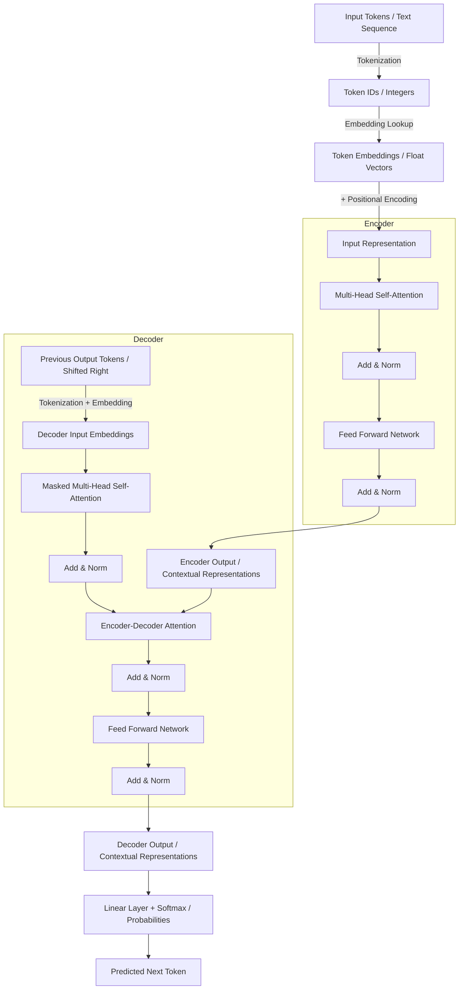

# BPE Tokenizer Implementation Algorithm

This document outlines the algorithm for training a Byte-Pair Encoding (BPE) tokenizer and using it to encode and decode text.

## Part 1: BPE Tokenizer Training

The goal of training is to learn a vocabulary and a series of merge rules from a text corpus.

### 1. Vocabulary Initialization

1.  **Base Vocabulary**: Create the initial vocabulary with all 256 possible bytes. The token IDs will be from `0` to `255`.
    -   `vocab = {i: bytes([i]) for i in range(256)}`
2.  **Special Tokens**: For each string in the `special_tokens` list:
    -   Assign it the next available integer ID (e.g., starting from 256).
    -   Add it to the vocabulary. The key should be the integer ID and the value should be the special token string encoded into bytes (e.g., `b'<|endoftext|>'`).
    -   Keep a separate mapping of special token strings to their assigned IDs for easy lookup during encoding.

### 2. Corpus Pre-processing and Pre-tokenization

This step prepares the raw text for efficient merging.

1.  **Split by Special Tokens**: Use the special tokens as delimiters to split the entire training corpus into smaller, independent chunks of text. This ensures that no merges will ever be learned across these special boundaries. A regex split is effective here.
2.  **Pre-tokenize Text Chunks**: For each independent text chunk:
    -   Use the provided GPT-2 regex pattern to split the chunk into a list of "pre-tokens" (words, punctuation, etc.).
    -   The pattern is: `r"""'(?:[sdmt]|ll|ve|re)| ?\p{L}+| ?\p{N}+| ?[^\s\p{L}\p{N}]+|\s+(?!\S)|\s+"""`. Remember to use the `regex` library for this, not the standard `re` library.
3.  **Count Pre-token Frequencies**: Create a frequency map (e.g., a `collections.Counter`) that stores each unique pre-token and how many times it appears in the corpus. The result should be a dictionary like `{' a': 1024, ' the': 980, ...}`.
4.  **Convert to Byte Representation**: Convert the frequency map from string keys to a byte representation. The new keys should be tuples of integers (byte values), making them easier to process.
    -   `"low"` becomes `(108, 111, 119)`.
    -   The structure will be like: `{(108, 111, 119): 5, (108, 111, 119, 101, 114): 2, ...}`.
    dict[tuple[bytes], int]

### 3. Iterative BPE Merging

This is the core loop where the tokenizer learns new subword units. Repeat this process until the vocabulary reaches the desired `vocab_size`.

1.  **Count Byte Pairs**:
    -   Iterate through the current pre-token frequency map (the one with byte-tuple keys).
    -   For each pre-token, find all adjacent pairs of bytes/tokens.
    -   Calculate the total frequency of each pair by summing the frequencies of the pre-tokens in which they appear. A `collections.Counter` is ideal for this.
2.  **Find the Best Pair**:
    -   Identify the byte pair with the highest frequency count.
    -   If there's a tie in frequency, choose the pair that is lexicographically greatest. For example, if `(b'e', b's')` and `(b's', b't')` are tied, select `(b's', b't')`.
3.  **Perform the Merge**:
    -   Create a new token by merging the best pair. For example, `(b's', b't')` becomes `b'st'`.
    -   Assign this new token the next available integer ID.
    -   Add the new token and its ID to your `vocab`.
    -   Record the merge operation, for example, in a list: `merges.append((b's', b't'))`.
4.  **Update Pre-tokens**:
    -   Create a new pre-token frequency map.
    -   Iterate through the old map and, for each pre-token, replace all occurrences of the "best pair" with the new merged token. For example, `(..., b's', b't', ...)` becomes `(..., b'st', ...)`. This updated map will be used in the next iteration.

### 4. Output

The training function should return:
-   `vocab`: A `dict[int, bytes]` mapping token IDs to their byte representation.
-   `merges`: An ordered `list[tuple[bytes, bytes]]` of the merge operations.

---

## Part 2: Encoding and Decoding

### Encoding

This process converts a new string into a sequence of token IDs.

1.  **Split by Special Tokens**: Just like in training, the first step is to break the input string into a list of alternating regular text chunks and special token strings.
2.  **Process Each Part**: Iterate through the list from the previous step.
    -   **If the part is a special token**: Look up its pre-assigned ID directly.
    -   **If the part is regular text**:
        a.  **Pre-tokenize**: Use the same GPT-2 regex to split the text chunk into pre-tokens.
        b.  **Apply Merges**: For each pre-token, convert it to a list of its initial bytes. Then, iteratively apply the *entire list* of learned `merges` in the exact order they were created. In each pass, find the first merge rule that can be applied to an adjacent pair in the current token list, apply it, and start the search over from the beginning of the merge list. Continue until no more merges can be applied.
        c.  **Look up IDs**: Convert the final sequence of merged tokens into token IDs by looking them up in the `vocab`.
3.  **Concatenate Results**: Combine the lists of token IDs from all parts into a single flat list.

### Decoding

This process converts a sequence of token IDs back into a string.

1.  **ID to Bytes**: For each integer ID in the input list, look up its corresponding `bytes` value in the final `vocab`.
2.  **Concatenate Bytes**: Join all the `bytes` objects together into a single `bytes` string.
3.  **Decode to String**: Decode the final `bytes` string into a Unicode string using UTF-8. Use `errors='replace'` to handle any potential malformed byte sequences gracefully, which will insert the official Unicode replacement character (`U+FFFD`) for invalid sequences.

---

## Part 3: Pseudocode

### BPE Training Pseudocode

```
FUNCTION train_bpe(corpus_text, vocab_size, special_tokens):
    // 1. Initialization
    vocab = new map from int to bytes
    merges = new list of (bytes, bytes) pairs

    // Initialize with base byte tokens
    FOR i FROM 0 TO 255:
        vocab[i] = bytes([i])

    // Add special tokens
    next_token_id = 256
    special_token_map = new map from string to int
    FOR token_str IN special_tokens:
        vocab[next_token_id] = token_str.encode("utf-8")
        special_token_map[token_str] = next_token_id
        next_token_id++

    // 2. Pre-tokenization
    // Split corpus by special tokens first to create independent text chunks
    special_token_pattern = create_regex_pattern_from(special_tokens)
    text_chunks = corpus_text.split(special_token_pattern)

    // Regex for pre-tokenizing words
    pre_tokenize_regex = compile_gpt2_regex()

    // Count frequencies of each "word"
    word_freqs = new Counter()
    FOR chunk IN text_chunks:
        pre_tokens = pre_tokenize_regex.findall(chunk)
        word_freqs.update(pre_tokens)

    // Convert word frequencies to a structure based on byte tuples
    // e.g., "low" (freq 5) -> (b'l', b'o', b'w'): 5
    byte_word_freqs = new map from tuple_of_bytes to int
    FOR word, freq IN word_freqs.items():
        byte_word = tuple(word.encode("utf-8"))
        byte_word_freqs[byte_word] = freq

    // 3. Iterative Merging
    num_merges = vocab_size - len(vocab)
    FOR i FROM 0 TO num_merges - 1:
        // Count frequencies of all adjacent pairs in all words
        pair_freqs = get_pair_frequencies(byte_word_freqs)
        
        IF pair_freqs is empty:
            BREAK // No more pairs to merge

        // Find the most frequent pair, breaking ties lexicographically
        best_pair = find_best_pair(pair_freqs)

        // Merge the best pair
        new_token_bytes = best_pair[0] + best_pair[1]
        new_token_id = next_token_id
        next_token_id++

        // Update vocab and merges list
        vocab[new_token_id] = new_token_bytes
        merges.append(best_pair)

        // Update the byte_word_freqs map by replacing all occurrences of best_pair
        // with the new token. This is the most complex step.
        byte_word_freqs = merge_pair_in_words(byte_word_freqs, best_pair, new_token_bytes)

    RETURN vocab, merges

END FUNCTION
```

### Encoding Pseudocode

```
FUNCTION encode(text, vocab, merges, special_tokens):
    // Create reverse map for faster lookups
    token_to_id_map = reverse_map(vocab)
    special_token_pattern = create_regex_pattern_from(special_tokens)

    // 1. Split text by special tokens
    parts = text.split_with_delimiters(special_token_pattern)
    
    final_token_ids = new list of ints

    // 2. Process each part
    FOR part IN parts:
        IF part IS IN special_tokens:
            // It's a special token, look up its ID directly
            final_token_ids.add(token_to_id_map[part.encode("utf-8")])
        ELSE:
            // It's regular text, apply the full BPE process
            pre_tokenize_regex = compile_gpt2_regex()
            pre_tokens = pre_tokenize_regex.findall(part)

            FOR pre_token IN pre_tokens:
                // Convert word to a list of its constituent bytes/tokens
                byte_list = list(pre_token.encode("utf-8"))

                // Apply all learned merges in order
                // This loop continues until a full pass over `merges` results in no changes
                WHILE True:
                    has_merged = False
                    // Find the first possible merge to apply
                    FOR pair_to_merge IN merges:
                        // Find where this pair occurs in the current byte_list
                        indices = find_all_occurrences(byte_list, pair_to_merge)
                        IF indices exist:
                            // Merge the first occurrence of the pair
                            new_token = pair_to_merge[0] + pair_to_merge[1]
                            byte_list = replace_pair_at_index(byte_list, pair_to_merge, new_token, indices[0])
                            has_merged = True
                            BREAK // Restart scan from the beginning of `merges` list
                    
                    IF NOT has_merged:
                        BREAK // No more merges can be applied to this word

                // Convert final tokens to IDs and add to result
                FOR token IN byte_list:
                    final_token_ids.add(token_to_id_map[token])

    RETURN final_token_ids

END FUNCTION
```

### Decoding Pseudocode

```
FUNCTION decode(token_ids, vocab):
    all_bytes = new empty bytes object

    // 1. Look up bytes for each token ID
    FOR id IN token_ids:
        token_bytes = vocab.get(id)
        all_bytes += token_bytes

    // 2. Decode the concatenated bytes into a string
    // Use error handling for invalid byte sequences
    final_string = all_bytes.decode("utf-8", errors="replace")

    RETURN final_string

END FUNCTION
```

# Transformer

